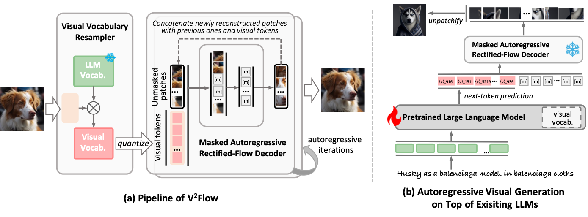
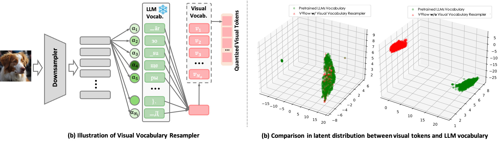
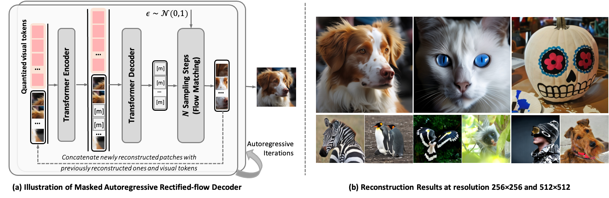
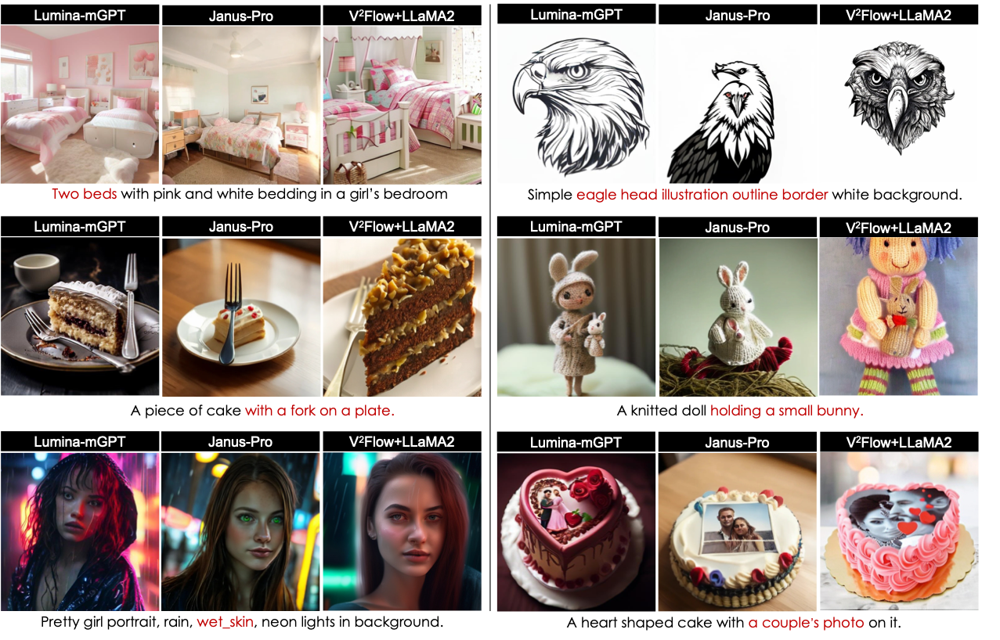

<h1 align='center'>V²Flow: Unifying Visual Tokenization and Large Language Model Vocabularies for Autoregressive Image Generation</h1>

    

<!-- ## 🚀 Overview

  

 -->

# 📖 Introduction

V²Flow introduces an advanced vector-quantized image tokenizer designed to seamlessly integrate visual tokenization with existing large language model (LLM) vocabularies. By aligning structural representations and latent distributions between image tokens and textual tokens, V²Flow enables effective autoregressive image generation leveraging pre-trained LLMs.

# ✨ Highlights

###  1. Structural and Latent Distribution Alignment  with LLM's Vocabulary:

###  2. Masked Autoregressive Reconstruction from a Flow-matching Perspective:

### 3. Autoregressive Visual Generation on Top of Existing LLMs:

# 🧩 Project Updates
* **2025-03-31:** Release of the complete training and inference codebase for [V²Flow](https://arxiv.org/abs/2503.07493). Pretrained models (1024x1024 and 512x512 resolutions) will be available shortly.
* **2025-03-10:** [V²Flow](https://arxiv.org/abs/2503.07493) is released on arXiv.

# 🚀 Training & Inference

## V²Flow Tokenizer
The complete data preparation, training, and inference instructions for the V²Flow tokenizer can be found [here](docs/V2Flow.md).

# 🚀 Open-source Plan

- V²Flow tokenizer
  - [x] Training and inference codes 
  - [ ] Checkpoints
  - [ ] Gradio Demo
- V²Flow+LLaMA for Autoregressive Visual Generation
  - [ ] Training and inference codes  
  - [ ] Checkpoints
  - [ ] Gradio Demo

# Acknowledgement

We thank the great work from [MAR](https://github.com/LTH14/mar),  [LLaVA](https://github.com/haotian-liu/LLaVA) and [VideoLLaMA](https://github.com/DAMO-NLP-SG/VideoLLaMA2)