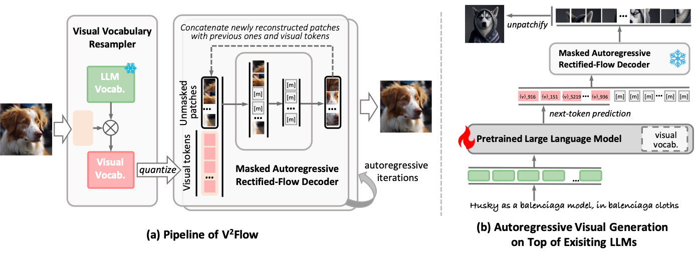
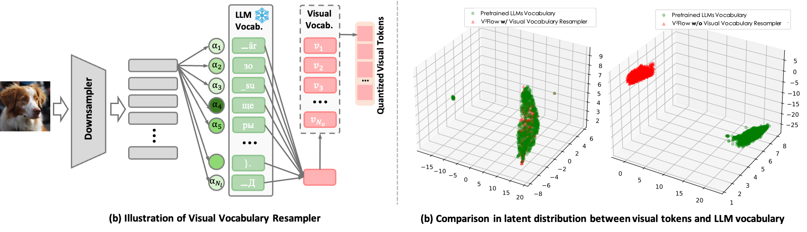
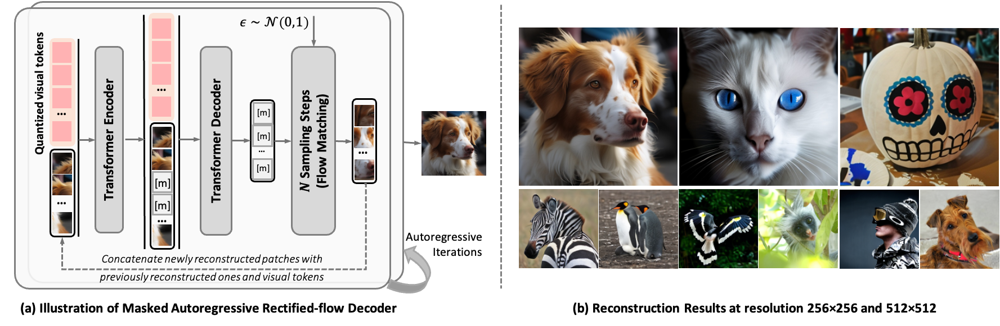
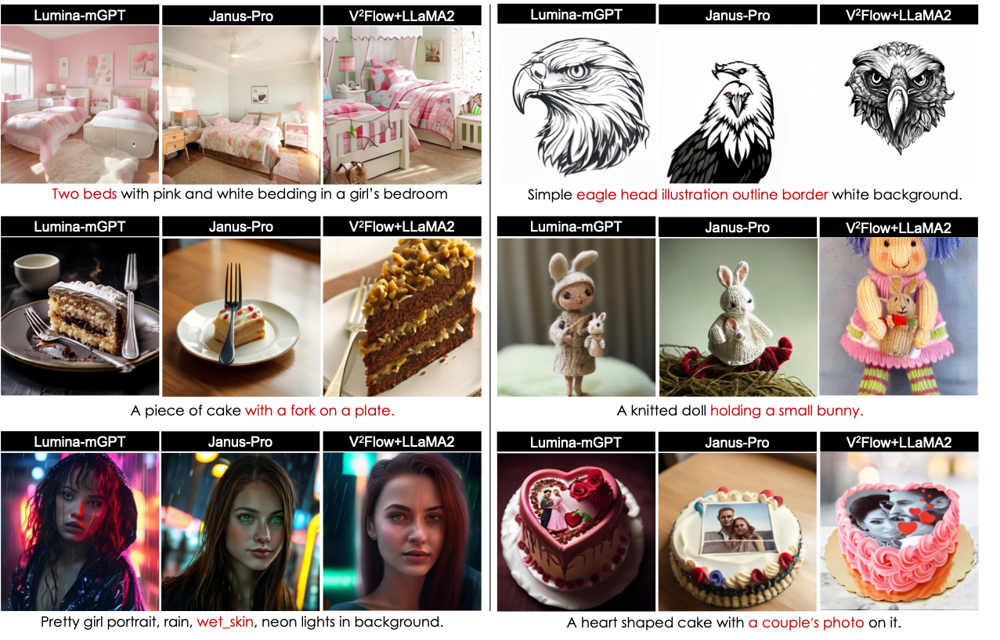

<h1 align='center'>V²Flow: Unifying Visual Tokenization and Large Language Model Vocabularies for Autoregressive Image Generation</h1>

    

## 🚀 Overview

  

## 🔥🔥🔥 Highlights

### 🔥 Structural and Latent Distribution Alignment  with LLM's Vocabulary:

### 🔥 Masked Autoregressive Reconstruction from a Flow-matching Perspective:

### 🔥 Autoregressive Visual Generation on Top of Existing LLMs:

## 🧩 Updates
* **2025-03-10:** [V²Flow](https://arxiv.org/abs/2503.07493) is released on arXiv.

## 📑 Open-source Plan

- V²Flow tokenizer
  - [ ] Training and inference codes 
  - [ ] Checkpoints
  - [ ] Gradio Demo
- V²Flow+LLaMA for Autoregressive Visual Generation
  - [ ] Training and inference codes  
  - [ ] Checkpoints
  - [ ] Gradio Demo

## Acknowledgement

We thank the great work from [MAR](https://github.com/LTH14/mar),  [LLaVA](https://github.com/haotian-liu/LLaVA) and [VideoLLaMA](https://github.com/DAMO-NLP-SG/VideoLLaMA2)
